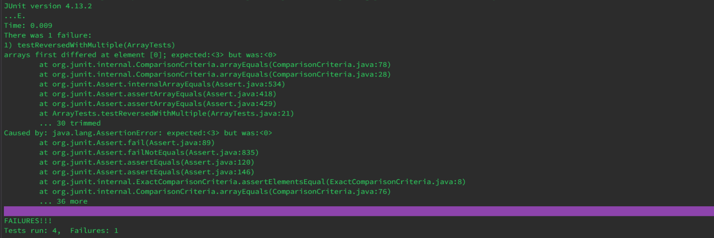

# **Haolin's Xie Lab Report3**
## Bug with failure-inducing input 
````Java
  @Test
  public void testReversedWithMultiple(){
    int[] input1 = {1, 2, 3};
    assertArrayEquals(new int[]{3, 2, 1}, ArrayExamples.reversed(input1));
  }
````

## Bug without failure-inducing input
````Java
  @Test public void testReversedWithEmpty(){
    int[] input1 = {};
    assertArrayEquals(new int[]{}, ArrayExamples.reversed(input1));
  }
````
## Symtomps of the outputs


## Bug before the fix 
```Java
static int[] reversed(int[] arr) {
    int[] newArray = new int[arr.length];
    for(int i = 0; i < arr.length; i += 1) {
      arr[i] = newArray[arr.length - i - 1];
    }
    return arr;
  }
````

## After the fix 
````Java
 static int[] reversed(int[] arr) {
    int[] newArray = new int[arr.length];
    for(int i = 0; i < arr.length; i += 1) {
      newArray[i] = arr[arr.length - i - 1];
    }
    return newArray;
  }
````
Before the fix, it adds elements from a newly created (empty) array to the current array. 
By adding elements from an empty array, elements added will always be empty.
With the change, this implementation transfers elements from array given to a new array in a reversed order. 

## Research `find` command
Promp given to ChatGPT: `how to use the bash command find`
ChatGPT output: `The find command in Bash is a powerful tool for searching for files and directories in a directory hierarchy. Here's a basic syntax:

find [directory] [options] [expression]
Here's a breakdown of the components:

[directory]: Specifies the directory where find should start the search. If you omit this, find starts in the current directory.
[options]: Optional flags that modify the behavior of the find command.
[expression]: Specifies what to search for. This can be file names, types, sizes, permissions, and more.
Here are some common options and expressions:

Options:

-name pattern: Searches for files and directories with a specific name pattern.
-type type: Searches for files of a specific type. Types include f for regular files, d for directories, l for symbolic links, and more.
-size [+|-]size: Searches for files of a specific size. You can specify the size in bytes, kilobytes (k), megabytes (M), gigabytes (G), etc. Prefix + means greater than, - means less than, and no prefix means exactly that size.
-exec command {} \;: Executes a command on each file found. {} is replaced by the file name. \; marks the end of the command.
-print: Prints the path of the found files.
-delete: Deletes the found files. Be cautious when using this option.
Expressions:

-name "*.txt": Finds files with names ending in .txt.
-type f: Finds regular files.
-type d: Finds directories.
-size +1M: Finds files larger than 1 megabyte.
-user username: Finds files owned by a specific user.
-perm mode: Finds files with specific permissions.`
