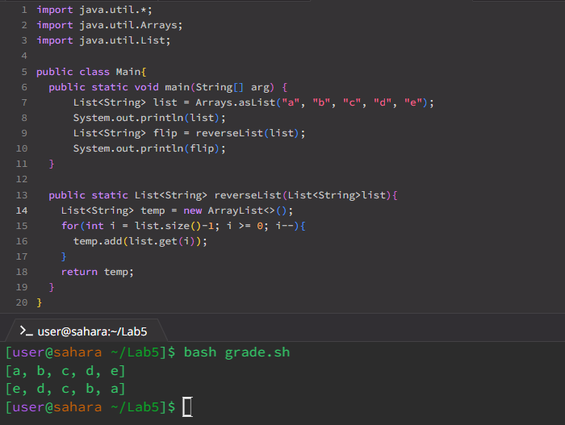
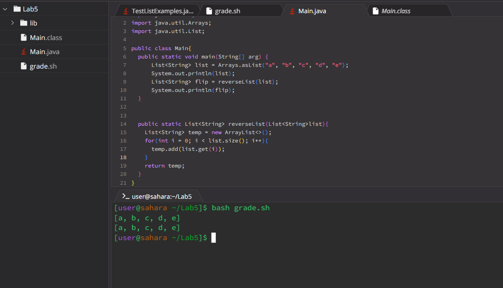
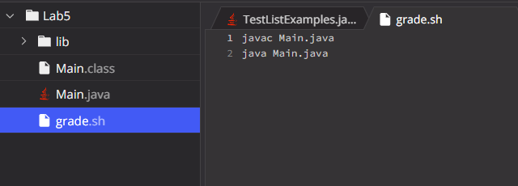

# Haolin Xie's Lab Report 5 
## Orginal post by student
I'm trying to create a new list with a reversed order of the current one. Instead of giving me the anticpated list, it gave me the same list. I'm not sure what I'm doing wrong, here's a screenshot of my codes


## TA response
Hi, take a look at your `reverseList` method again. The method essentially creates a new empty list and add elements of the argument list to the newly created list. Think how you would change the order of the list being added. Hint: consider adding the last elment first. 

## Student follow up
Following your hint, I did some modifications to my `reverseList`. In the beginning I only create a new list, but did not add elements to the newly created list in a reverse order. Now I made the index of the list as the starting index of my for-lopp, and the condition for the loop is `>= 0`. For everytime the for-loop I would decrement the starting index by 1. This allows me to print all the elements in the list in the reverse order. Below is a screenshot of my method.
<br>  
<br> The outputs is what I expected so I believe this methods works, thanks for your help. 

## Setup 
Inside the `Lab5` folder, there is the `Main.java`, which is where the program is located, and `grade.sh`, which is it compiles and runs the java file `Main.java`
### content of the file 
This the code in `Main.java` before the bug is fixed. On the left of the image, the directories and files are shown. 
<br> <br>
<br>
This is the content in `Grade.sh`
<br> <br>
### Command to trigger the bug 
The command to trigger the bug is `bash Grade.sh`, which compiles and executes java file `Main.java`
### Fixing the bug 
`reverseList` method before fix: 
```
public static List<String> reverseList(List<String>list){
    List<String> temp = new ArrayList<>();
    for(int i = 0; i < list.size(); i++){
      temp.add(list.get(i));
    }
    return temp; 
  }
```
`reverseList` method after fix:
```
public static List<String> reverseList(List<String>list){
    List<String> temp = new ArrayList<>();
    for(int i = list.size()-1; i >= 0; i--){
      temp.add(list.get(i));
    }
    return temp; 
  } 
```
The for-loop was set that the index of the last element in the list is starting index, and the first index (0 index) is the ending point of the for-loop. Everytime that the forloop is ran, `i` is decremted by one. 
## Reflection
I find bash scripts to be very interesting. Instead of writing code to compile and run the java file over and over again I can store all these commands in a bash script. All I need to do to compile and run the java file it to use to bash script. This is much more efficient and most importantly help me avoid carpel tunnel. 
