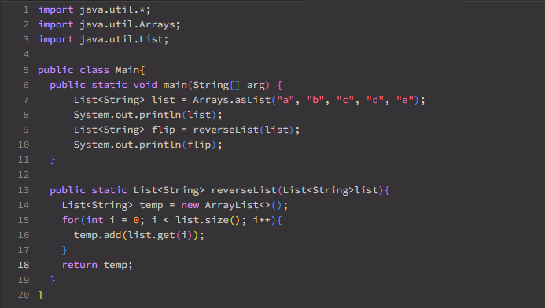

# Lab Report 5 
## Orginal post by student
I'm trying to create a new list with a reversed order of the current one. Instead of giving me the anticpated list, it gave me the same list. I'm not sure what I'm doing wrong, here's a screenshot of my codes

## TA response
Hi, take a look at your `reverseList` method again. The method essentially creates a new empty list and add elements of the argument list to the newly created list. Think how you would change the order of the list being added. Hint: consider adding the last elment first. 
